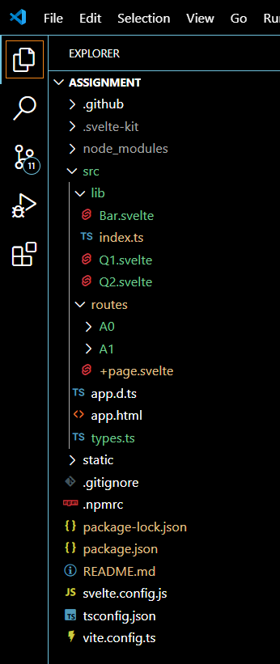
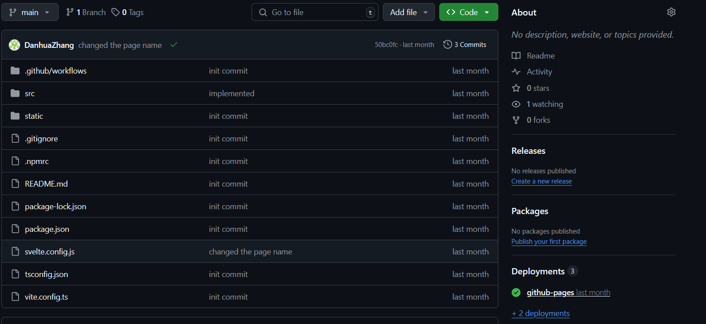
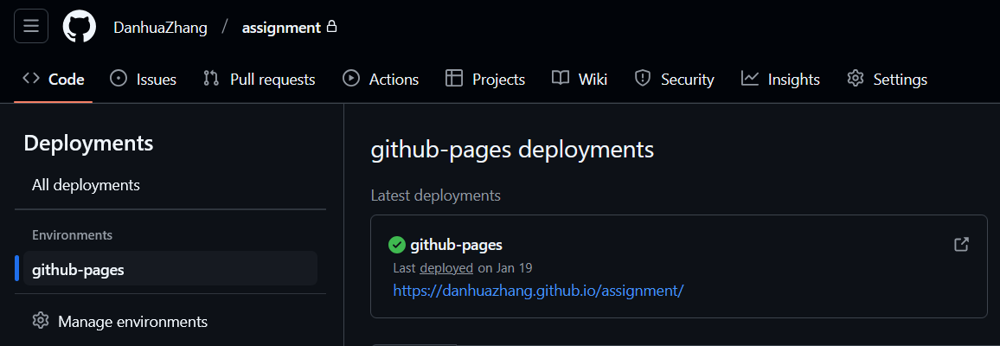

# A1 sample answer

This project provides a sample answer to A1, and illustrates how to deploy and publish the svelte project to Github Pages. Please bookmark it for future reference.

## Configuration

Some instructions in each assignment are based on previous ones, so it is HIGHLY RECOMMENDED to use the same Github repo for all of your assignments for convenience. 

MAKE SURE you have every package installed in your local repo. In each assignment, different packages might be used and thus need to be installed. Please pay attention to it when you follow the assignment instructions.

So far you should have had run the following commands:
```
npx sv create FOLDERNAME (from A0)
npm i -D --save @sveltejs/adapter-static (from A0)
npm i -S d3
npm i --save-dev @types/d3
```
## Developing & Debugging


> **Note**: Please make sure you are using **Chrome** for your assignments. Some browsers are not ideal for front-end development. For example, the curves in A2 will not show up in Firefox, while it is visible in Chrome.

To launch the local host run the following commands:

```bash
npm run dev

# or start the server and open the app in a new browser tab
npm run dev -- --open
```


While debugging, a commonly-used approach is to use `console.log()` function to track and inpect values of variables.


## Github Deployment

As mentioned in [A0](https://github.com/Visual-Intelligence-UMN/5609Visualization-Assignments/tree/main/A0-Setup), you are supposed to do the following:
1. Include `.github/workflows/build-and-deploy.yml` in your root folder;
2. Replaced `svelte.config.js` in your root folder;
3. Replaced `FOLDERNAME` with your own foldername in `svelte.config.js`

You are supposed to see the hierarchy of your local folder is the same or at least similar to the screenshot below:


After pushing to Github, it should be the same or similar to the hierarchy of this Github repo.

## Submission

Github repo link is the link to the repo where one can see the root of the hierarchy. MAKE SURE that it's set to `private`, and the professor and the TA have been invited as collaborators. 


Github page link is a public url that is generated after the project is successfully deployed to Github.

To submit A1 for example, the links to be submitted should be:
- https://github.com/DanhuaZhang/assignment (Github repo)
- https://danhuazhang.github.io/assignment/A1 (Github page)

To get the link, it's located below Deployments section on the right side.


Please ALWAYS double check to make sure that the link works.
